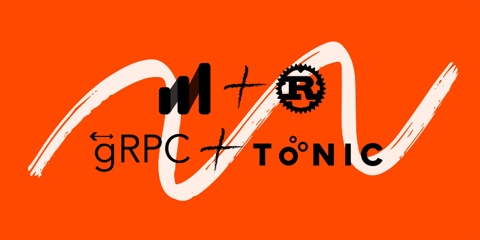

# Microservices based on gRPC with Rust



## Introduction

<p align="justify">In the world of modern software development, building highly performant and scalable distributed systems is a common challenge. To tackle this, the protocol buffers and the gRPC framework has gained significant popularity due to its efficient communication protocol and language-agnostic nature.</p>

### What is gRPC

<p align="justify">gRPC is an open source framework for general-purpose RPCs across a network developed by Google.
gRPC supports full-duplex streaming and is also mostly aligned with HTTP/2 semantics. It supports different media formats, such as Protocol Buffers (Protobuf), JSON, XML, and Thrift. Protobuf is the default media format. The use of Protobuf aces the others because of higher performance.</p>

### How does gRPC work

<p align="justify">gRPC allows two applications in different processes or machines to communicate with each other as if they were in the same process. This is useful for distributed applications, such as microservices or high-availability systems.</p>

### gRPC has the following advantages

  - Scalability: gRPC uses HTTP/2, which is an efficient protocol that allows scaling the performance of RPC calls.

  - Performance: gRPC uses Protocol Buffers, which is an efficient data description language that helps reduce the size of RPC messages.

  - Security: gRPC supports a variety of security mechanisms, such as authentication and encryption.

### When to use gRPC

gRPC is a good choice for the following applications:

  - Microservices: gRPC is a good choice for communication between microservices, as it allows scaling the performance and throughput of RPC calls.

  - High-availability systems: gRPC is a good choice for high-availability systems, as it allows applications to communicate with each other even if one of the applications fails.

  - Internal API integrations: gRPC is a good choice for internal API integrations, as it allows efficient communication between applications that are written in different programming languages.


## gRPC service built with Tonic and Instrumented with Autometrics

### Local Observability Development

The easiest way to get up and running with this application is to clone the repo and get a local Prometheus setup using the [Autometrics CLI](https://github.com/autometrics-dev/am).

Read more about Autometrics in Rust [here](https://github.com/autometrics-dev/autometrics-rs) and general docs [here](https://docs.autometrics.dev/). 

Join the Autometrics Discord:
[](https://discord.gg/kHtwcH8As9)

### Install the Autometrics CLI

The recommended installation for macOS is via [Homebrew](https://brew.sh/):

```
brew install autometrics-dev/tap/am
```

Alternatively, you can download the latest version from the [releases page](https://github.com/autometrics-dev/am/releases)

<p align="justify">Spin up local Prometheus and start scraping your application that listens on port :8080.</p>

```
am start :8080
```

<p align="justify">Now you can test your endpoints and generate some traffic.</p>

### Testing the GRPC endpoints

<p align="justify">Easiest way to test the endpoints is with `grpcurl` (`brew install grpcurl`).</p>

```bash
grpcurl -plaintext -import-path ./proto -proto job.proto -d '{"name": "Tonic"}' 'localhost:50051' job.JobRunner.SendJob
```

returns

```
{
  "message": "Hello Tonic!"
}
```

<p align="justify">Getting the list of jobs (currently hardcoded to return one job)</p>

```bash
grpcurl -plaintext -import-path ./proto -proto job.proto -d '{}' 'localhost:50051' job.JobRunner.ListJobs
```

returns:

```
{
  "job": [
    {
      "id": 1,
      "name": "test"
    }
  ]
}
```

If you now inspect the Autometrics explorer on `http://localhost:6789` you will see your metrics.